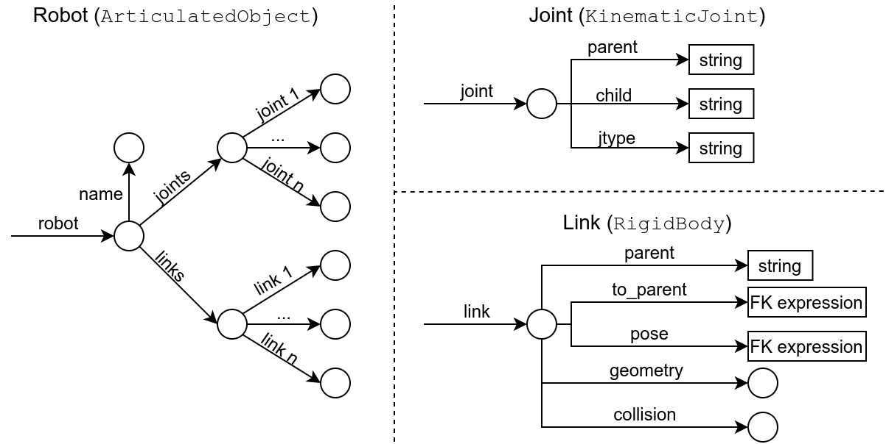

Welcome to Kineverse
====================

Welcome to the documentation for the *Kineverse* library -- a Python package for creating and managing articulation models using symbolic mathematical expressions.

What is Kineverse for?
----------------------

Kineverse is meant for creating models of articulated objects (e.g. robots, furniture, ...) for run-time usage. Kineverse differs from URDF, SDF, and similar formats in that it takes a functional approach to modeling.
Formats like URDF describes a robot as a tree of links and specific types of joints. This description then needs to be converted into mathematical objects with which computations can be performed.

Kineverse stores a model directly as a set of mathematical expressions, avoiding implementation error and effort, and allowing for a greater set of articulation models, as long as they define a forward kinematic expression.

Aside from this, Kineverse models are meant to be flexible and able to change at runtime. To this end, the Kineverse library implements a client and server system for exchanging articulation models in a ROS environment.

Getting Started
===============

Hello and welcome to the world of Kineverse! This multi-step guide will get you up and running with the kineverse library.

Installation
------------

Before we can dive in, you will need a couple of libraries to get started. It is assumed that you are familiar with ROS and catkin. 
Kineverse depends five libraries

 - GiskardPy: `https://github.com/SemRoCo/giskardpy`
 - QPOases: `https://github.com/SemRoCo/qpOASES.git`
 - Symengine: `https://github.com/symengine/symengine`
 - SymenginePy: `https://github.com/symengine/symengine.py`
 - Bullet: `https://github.com/ARoefer/bullet3`

The Basics
----------

Fundamentally, Kineverse is concerned with building an articulation model for a world. Formally this model is referred to as :math:`\mathcal{A} = (\mathcal{D}, \mathcal{C})`, however, that is not really important for this hands-on guide. Important is that a model consists of...

 - ... a tree of data and...
 - ... a set of constraints

The base class for Kineverse models is the :py:class:`kineverse.model.articulation_model.ArticulationModel` class.
Let's create one:

.. code-block:: python

    from kineverse.model.articulation_model import ArticulationModel

    km = ArticulationModel()

And thus we have an articulation model! Well, it's empty for now, but we can change that:

.. code-block:: python

    km = ArticulationModel()

    km.set_data('my_var', 5)

Now the model contains a value called *my_var* which is equal to the integer *5*. While this is not all that exciting, we can also retrieve the value:

.. code-block:: python

    km = ArticulationModel()

    km.set_data('my_var', 5)
    a = km.get_data('my_var', 5)
    # a is now 5

The Kineverse model can not only do single variables, but it can actually handle deeper paths, as in the following example:

.. code-block:: python

    km = ArticulationModel()

    km.set_data('my_var', {})
    km.set_data('my_var/foo', 5)
    a = km.get_data('my_var/foo', 5)
    # a is now 5

Paths in a Kineverse model work the same as paths in a file system. The model supports paths being encoded as strings, however it is more efficient to manage paths using the :py:class:`kineverse.model.paths.Path` class:

.. code-block:: python

    from kineverse.model.paths import Path

    km = ArticulationModel()

    foo_path = Path('my_var/sub_var/some_more_var/foo')

    for x in range(len(foo_path) - 1):
        if not km.has_data(p[:x]):
            km.set_data(p[:x], {})
    
    km.set_data(foo_path, 5)
    a = km.get_data(foo_path, 5)
    # a is now 5

In the example above we see that it is convenient to use the path implementation, since we can perform typical sequence operations on it.
This is used in the example to create the non-existent parts of the model, before writing the 5 to it.
We can also see the use of the :py:meth:`kineverse.model.articulation_model.ArticulationModel.has_data` function. Quite obviously, this function can be used to confirm that a path is defined in the model. If we try to retrieve non-existent data, or write to a non-existent path a :py:class:`kineverse.model.paths.PathException` is raised.

The previous examples were not exactly practical, but only served to introduce simple data access and the concepts of paths. Let's actually put something more interesting into the model:

.. code-block:: python

    import kineverse.gradients.gradient_math as gm

    km = ArticulationModel()
    
    a = gm.Position('a')
    t = gm.translation3(a, 0, 0)

    km.set_data('my_translation', t)

In this example, Kineverse's math library is imported as *gm*. Using that library, a positional variable *a* is created. It is used to define a translation along the X-axis, the translation is added to the model.
There are two new things here:

 1. Kineverse has a math library containing common spatial objects. (Yay!)
 2. Kineverse has a concept of variables, which are typed.

The second observation is an important one to talk about for a second. Under the hood, Kineverse uses a symbolic math framework to construct mathematical objects. The free variables in these models define the degrees of freedom of the overall model. As an extra, Kineverse adds the concept of variable types. These types are used to constrain the different aspects of a degree of freedom. The following snippet creates variables to reference the position, velocity, acceleration, and jerk of degree of freedom *a*:

.. code-block:: python

    p = gm.Position('a')
    v = gm.Velocity('a')
    a = gm.Acceleration('a')
    j = gm.Jerk('a')

Instead of creating these symbols explicity, they can also be instantiated using operations which mimick the semantics of integration and differentiation:

.. code-block:: python

    v = gm.Velocity('a')
    p = gm.IntSymbol(v)
    a = gm.DiffSymbol(v)
    j = gm.DiffSymbol(a)

Now let's use these symbols to constrain a degree of freedom. Going back to the example above, we are going to limit the position of *a* to be in [-2, 3] and limit its velocity to be in [-1, 1].

.. code-block:: python
    
    from kineverse.model.articulation_model import Constraint

    km = ArticulationModel()
    
    a = gm.Position('a')
    t = gm.translation3(a, 0, 0)
    c_p = Constraint(-2, 3, a)
    c_v = Constraint(-1, 1, gm.DiffSymbol(a))

    km.set_data('my_translation', t)
    km.add_constraint('limit a pos', c_p)
    km.add_constraint('limit a vel', c_v)

As you can see in the snippet, we import the :py:class:`kineverse.model.articulation_model.Constraint` class and instantiate two constraints, one for the position and one for the velocity. While the constraints can also be retrieved from the model explicitly, this is not how they are usually used. The next example will cover a common use case.

.. code-block:: python

    # Setting up the model
    km = ArticulationModel()
    
    a = gm.Position('a')
    b = gm.Position('b')
    t = gm.translation3(a, 0, b)
    c_ap = Constraint(-2, 3, a)
    c_av = Constraint(-1, 1, gm.DiffSymbol(a))
    c_bp = Constraint( 0, 1, b)

    km.set_data('my_translation', t)
    km.add_constraint('limit a pos', c_ap)
    km.add_constraint('limit a vel', c_av)
    km.add_constraint('limit b pos', c_bp)

    # Using it
    # Creating an expression
    e = gm.dot_product(gm.vec3(1, 0, 0), 
                       gm.pos(km.get_data('my_translation')))
    
    # Retrieve the expression's free symbols
    fs = gm.free_symbols(e)
    # fs = {a}

    # Fetch relevant constraints from model
    cs = km.get_constraints_by_symbols(fs)
    # cs = {'limit a pos': c_ap}

In the above example, the previous translation is expanded to include another DoF along the Z-axis. Then an expression is created, which is the dot product of the translation's position and the vector :math:`(1,0,0)`. We see that we can use the :py:meth:`kineverse.gradients.gradient_math.free_symbols` function to get the set of free symbols from an expression. 
Given a set of symbols, we can query the articulation model for the constraints which are relevant to these symbols.

While this is a toy example, it does model the intended usage strategy for the Kineverse model. In a real application, a user would create a set of expressions for whatever problem they are working on. From this set they would collect all free symbols and then retrieve all the relevant constraints from the model.

Now that we are familiar with the common way of using a model, we would probably like to model something more complicated. If your thought just now was "Damn, now I have to convert my URDFs to this thing to use it?" I can allay concerns: Kineverse can load URDFs. So as a last example, let's do just that:

.. code-block:: python
    
    from kineverse.operations.urdf_operations import load_urdf
    from kineverse.urdf_fix                   import urdf_filler
    from kineverse.utils                      import res_pkg_path

    from urdf_parser_py.urdf import URDF

    # Load the URDF model
    urdf_model = urdf_filler(URDF.from_xml_file(res_pkg_path('package://kineverse/urdf/microwave.urdf')))

    # Setting up the model
    km = ArticulationModel()
    
    # Add the microwave to the model
    load_urdf(km, 'microwave', urdf_model)
    
    # Clean the model - this will be discussed in more detail later
    km.clean_structure()

    # Using it
    door_pose = km.get_data('microwave/links/door/pose')

    # Retrieve the free symbols of the door's pose
    fs = gm.free_symbols(door_pose)

    # Fetch relevant constraints from model
    cs = km.get_constraints_by_symbols(fs)

The code above loads the URDF model of a microwave that comes with the Kineverse package. The URDF is loaded using the standard URDF loader. As you can see, it is processed by the :py:meth:`kineverse.urdf_fix.urdf_filler` function. This is done to mitigate a structural mismatch that can be found in between the URDFs loaded in ROS Kinetic and ROS Melodic.

The processed URDF model is added to the articulation model using the :py:meth:`kineverse.urdf_operations.load_urdf` function. This function adds a URDF to the given model at the provided path. In this case, the model is added under the path *microwave*.
Once the model is added, the function :py:meth:`kineverse.model.articulation_model.ArticulationModel.clean_structure` is called. Calling this function ensures that the model is fully formed and usable. We will talk about what exactly it does at a later point where we will also address the correct way to build models.

In the last bit of the code the loaded microwave is actually used. While most of that seems very familiar from the previous example, it is worthwhile to address the magical path *microwave/links/door/pose*. The *load_urdf* function creates a representation of the URDF object in the model. The larger container is implemented by the :py:class:`kineverse.model.geometry_model.ArticulatedObject` class. This class holds a dictionary of links and joints. The joints can be viewed as meta-data about the original object, which is not necessary to construct the kinematic of the links. All links are instantiated as :py:class:`kineverse.model.geometry_model.RigidBody` and hold their FK-pose w.r.t. the world frame, as well as the pose w.r.t. their parent frame, and geometry information for visuals and collision.
The figure below displays the paths of the full data structure.

   The path structure of an articulated object loaded from a URDF.

Next Steps
----------

Now we have reached the end of this introduction. There are two ways you can go from here:

 1. :ref:`chapter-operations` are the key mechanism by which Kineverse builds articulation models. If you ever want to do more than just load a couple URDFs, you should probably know about these.
 2. :ref:`chapter-models` -- yes, plural! In the previous text we learned about the :py:class:`kineverse.model.articulation_model.ArticulationModel` class. There are actually three articulation model classes in Kineverse and it is worthwhile knowing about these.

